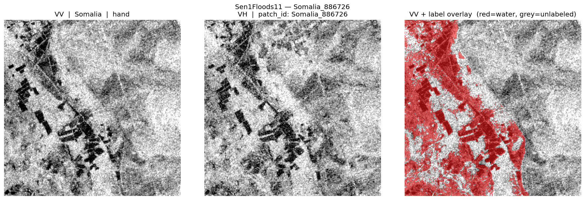
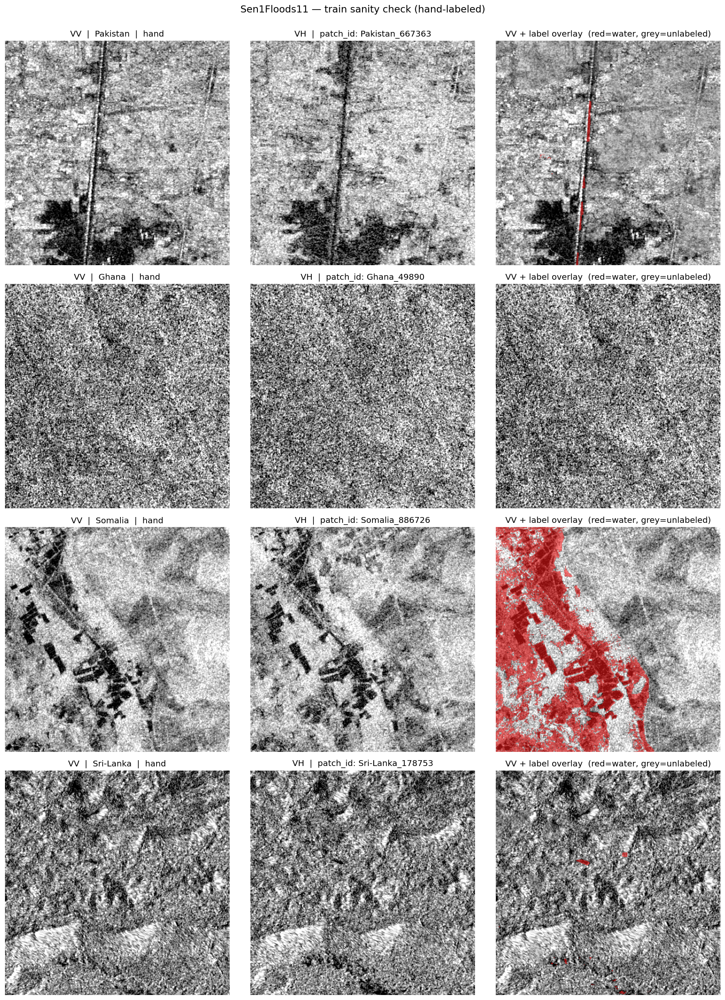

# Sentinel-1 SAR Flood-Extent Pipeline

[](https://www.python.org/)
[](LICENSE)
[](#roadmap)

Deep-learning segmentation pipeline that takes Sentinel-1 Synthetic Aperture Radar (SAR) imagery as input and produces binary flood-extent masks. Trained on the [Sen1Floods11][s1f] benchmark and validated against FEMA flood-extent polygons for Hurricane Ida (2021) and Hurricane Katrina (2005) in Harrison County, Mississippi.



*Left: VV polarization. Middle: VH polarization. Right: VV with hand-labeled flood overlay (red = water, grey = unlabeled / quality-masked). Sample from the Somalia region in the Sen1Floods11 hand-labeled training subset.*

---

## Why SAR for flood mapping?

Optical satellite imagery (Sentinel-2, Landsat) struggles with floods because storm cloud cover blocks visibility precisely when the flood is most active. SAR penetrates clouds and works at night, making it the only practical data source for near-real-time flood mapping during ongoing events.

The downstream goal of this project is producing validated flood-extent polygons for two well-documented Mississippi Gulf Coast hurricane events — Ida (2021) and Katrina (2005) — where FEMA-published disaster-extent polygons serve as independent ground truth. Most Sen1Floods11 portfolio projects stop at the benchmark test split; this one carries through to a real US disaster validation.

---

## Dataset

[Sen1Floods11][s1f] (Bonafilia et al., 2020):

| Split | Samples | Hand-labeled | Weak-labeled | Regions |
|---|---|---|---|---|
| Train | 3,759 | 252 | 3,507 | 12 |
| Val   | 966   | 89  | 877   | 12 |
| Test  | 105   | 105 | 0     | 11 |

The test set is 100% hand-labeled — reported test metrics are against pristine ground truth, no weak-label-noise caveats. The training set is dominated by weak (Otsu-thresholded) labels with a small hand-labeled core; both hand-only and curriculum (weak-pretrain → hand-finetune) strategies are on the evaluation plan.

Region distribution is intentionally non-proportional. Mekong dominates train at 29% but is only 5.7% of test; USA is balanced across splits; Africa is under-represented throughout. Per-region test metrics are reported alongside the aggregate.



*Four hand-labeled training samples — Pakistan, Ghana, Somalia, Sri Lanka. Per-image 2nd–98th percentile contrast scaling so each panel auto-adjusts to its own dynamic range.*

---

## Stack

- Python 3.11+ with [uv](https://github.com/astral-sh/uv)
- [PyTorch](https://pytorch.org/) + [segmentation_models_pytorch](https://github.com/qubvel-org/segmentation_models.pytorch)
- [rasterio](https://rasterio.readthedocs.io/) for geospatial I/O
- [albumentations](https://albumentations.ai/) for augmentation
- [Hugging Face `datasets`](https://huggingface.co/docs/datasets) for the Sen1Floods11 mirror

---

## Quick start

```bash
git clone https://github.com/Governor6191/sar-flood-extent
cd sar-flood-extent
uv sync
hf auth login   # needed for the Sen1Floods11 download

# Inspect the dataset and regenerate the visualizations in this README
uv run python scripts/explore_dataset.py
```

First run downloads Sen1Floods11 (~80 GB) into `data/sen1floods11/`. Subsequent runs reuse the local cache. The exploration script prints split / region / label-source statistics, runs tensor sanity checks, and writes per-sample and grid PNGs to `outputs/figures/`.

---

## Project layout

```
sar-flood-extent/
├── src/                 # Python modules (Sen1FloodsDataset, etc.)
├── scripts/             # Runnable entrypoints
├── notebooks/           # Jupyter notebooks (exploration, training)
├── data/                # Local dataset cache — gitignored; see data/README.md
├── docs/figures/        # Curated portfolio visualizations (committed)
├── outputs/figures/     # Generated artifacts (gitignored, regenerable)
├── checkpoints/         # Model checkpoints — gitignored; released via HF Hub
├── pyproject.toml
└── README.md
```

---

## Roadmap

- [x] Repository foundation + reproducible Python env
- [x] Sen1Floods11 acquisition + schema documentation
- [x] PyTorch `Dataset` class with hand/weak label-source filtering
- [x] Dataset exploration + sanity-check visualizations
- [ ] Per-channel SAR normalization statistics (train split)
- [ ] U-Net + ResNet baseline training (hand-only)
- [ ] Curriculum experiment: weak-pretrain → hand-finetune
- [ ] Test-set evaluation with per-region breakdown
- [ ] FEMA polygon validation — Hurricane Ida 2021 (Harrison County, MS)
- [ ] FEMA polygon validation — Hurricane Katrina 2005 (Harrison County, MS)
- [ ] Pretrained model release on Hugging Face Hub
- [ ] End-to-end inference tutorial notebook

---

## License

[MIT](LICENSE)

## Citation

If you use this work, please cite the underlying Sen1Floods11 dataset:

```
Bonafilia, D., Tellman, B., Anderson, T., & Issenberg, E. (2020).
Sen1Floods11: a georeferenced dataset to train and test deep learning
flood algorithms for Sentinel-1.
CVPR Workshops, 210-211.
```

---

[s1f]: https://github.com/cloudtostreet/Sen1Floods11
