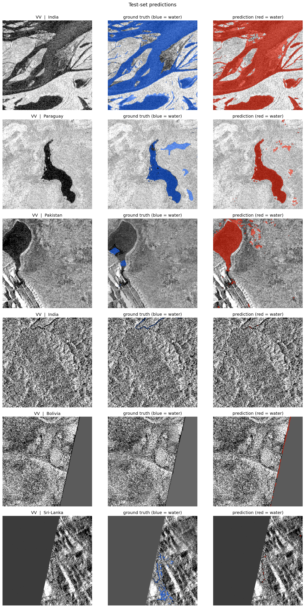
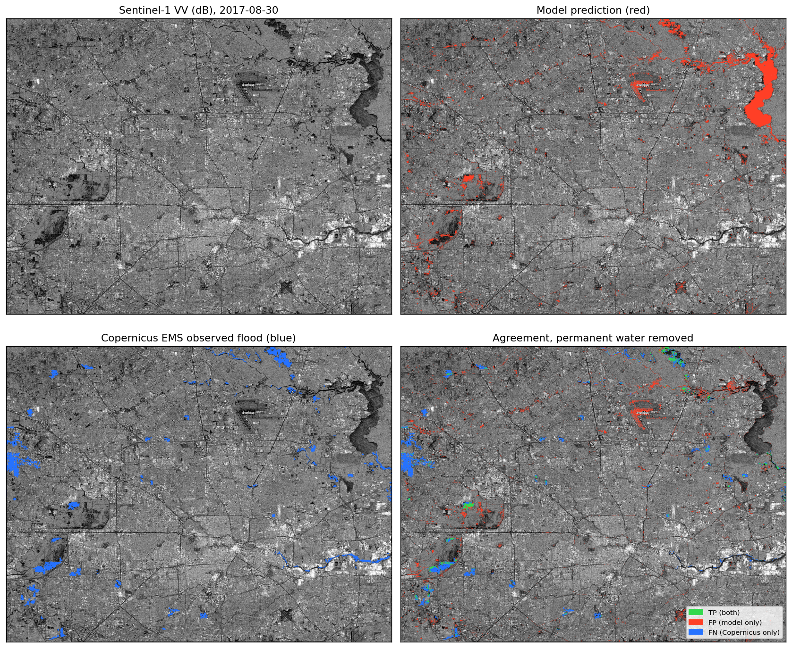
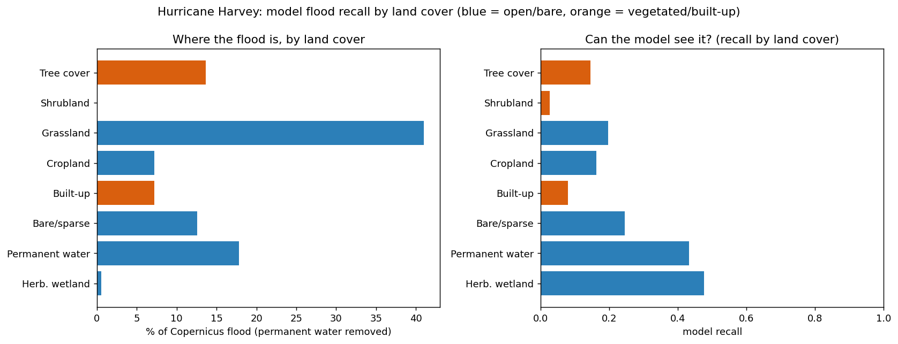

# Sentinel-1 SAR Flood-Extent Pipeline

[](https://www.python.org/)
[](LICENSE)
[](#roadmap)

A deep-learning segmentation pipeline that takes Sentinel-1 Synthetic Aperture Radar (SAR) imagery as input and produces binary flood-extent masks. Trained on the [Sen1Floods11][s1f] benchmark, then validated on a real Gulf Coast hurricane the model never saw: Hurricane Harvey over Houston in August 2017, scored against the Copernicus EMS flood delineation. See [Real-disaster validation](#real-disaster-validation).


*Left: VV polarization. Middle: VH polarization. Right: VV with hand-labeled flood overlay (red = water, grey = unlabeled). Sample from the Somalia region of the Sen1Floods11 hand-labeled training subset.*

---

## Why SAR for flood mapping?

Optical imagery (Sentinel-2, Landsat) gets blocked by storm cloud cover at exactly the moment a flood is most active. SAR penetrates clouds and works at night, so it's the only practical data source for near-real-time mapping during ongoing events.

The downstream goal is a validated flood-extent map for a well-documented US Gulf Coast event. Sentinel-1 launched in 2014, so the validation target is a post-2014 hurricane with Sentinel-1 coverage. Hurricane Harvey (Houston, August 2017) fits: catastrophic rainfall flooding, full Sentinel-1 coverage, and an independent flood delineation published by the Copernicus Emergency Management Service. Most Sen1Floods11 portfolio projects stop at the benchmark test split. This one carries through to a real US disaster the model never trained on.

---

## Dataset

[Sen1Floods11][s1f] (Bonafilia et al., 2020):

| Split | Samples | Hand-labeled | Weak-labeled | Regions |
|---|---|---|---|---|
| Train | 3,759 | 252 | 3,507 | 12 |
| Val   | 966   | 89  | 877   | 12 |
| Test  | 105   | 105 | 0     | 11 |

The test set is 100% hand-labeled, so reported test metrics are against pristine ground truth with no weak-label-noise caveats. Training is dominated by weak (Otsu-thresholded) labels with a small hand-labeled core. The shipped model trains on the full set (hand + weak) and beat a hand-only baseline on the held-out test split (see Results).

Region distribution is intentionally skewed. Mekong is 29% of train but only 5.7% of test. USA is balanced across splits. Africa is under-represented throughout. Per-region test metrics are reported alongside the aggregate.


*Four hand-labeled training samples (Pakistan, Ghana, Somalia, Sri Lanka). Per-image 2nd to 98th percentile contrast scaling, so each panel auto-adjusts to its own dynamic range.*

---

## Results

The shipped model is a U-Net with a ResNet34 encoder, trained on the full Sen1Floods11 training set (hand + weak labels) and evaluated on the 105-scene all-hand test split, which the model never saw during training or checkpoint selection.

**Overall test set, water class: IoU 0.67, F1 0.80.** Test tracks validation (0.666 test vs 0.670 val), so the model generalizes rather than memorizing the validation set.

This improved on a hand-only baseline (test IoU 0.64) by adding the 3,507 weak (Otsu-thresholded) training labels. The gain came from recall: precision held at 86% while recall rose from 72% to 74%, so the model caught more real water without flagging more dry land. More data, even noisy data, helped.

Performance varies a lot by region, which is expected since the test split spans 11 regions with different flood and terrain types:

| Region | IoU | F1 |
|---|---|---|
| Nigeria | 0.89 | 0.94 |
| Sri Lanka | 0.89 | 0.94 |
| Mekong | 0.87 | 0.93 |
| Spain | 0.70 | 0.83 |
| India | 0.69 | 0.81 |
| Paraguay | 0.68 | 0.81 |
| Bolivia | 0.65 | 0.79 |
| USA | 0.56 | 0.72 |
| Ghana | 0.55 | 0.71 |
| Somalia | 0.39 | 0.56 |
| Pakistan | 0.20 | 0.33 |

Pakistan is the clear weak spot, and adding weak labels barely moved it (0.17 to 0.20), so its terrain stays an open failure case. The aggregate 0.67 hides a range from 0.20 to 0.89, which is why per-region reporting matters more than a single headline number.



*VV input, ground truth (blue), and prediction (red) on six test scenes. The model captures clear river and floodplain water well and leaves dry scenes blank, while the low-scoring regions (Pakistan especially) show where it still struggles.*

---

## Real-disaster validation

The benchmark test split is still Sen1Floods11 data. The real question is whether the model works on a hurricane it never saw. Harvey flooded Houston in late August 2017, well outside the training set, so it's a fair test of whether the pipeline holds up on an actual Gulf Coast disaster.

**Prediction.** A Sentinel-1 GRD scene from Google Earth Engine (the August 30, 2017 descending pass over a west-southwest Houston box, lon -95.75 to -95.10, lat 29.60 to 30.10), standardized with the recovered Sen1Floods11 constants and run through the released model. See `scripts/pull_harvey_scene.py` and `scripts/infer_scene.py`.

**Ground truth.** The Copernicus EMS EMSR229 Houston delineation, an independent flood extent mapped from COSMO-SkyMed radar acquired August 28 and 30, 2017. The August 30 imagery lands on our Sentinel-1 acquisition date, so this is a radar-to-radar comparison of the same flood.

Scores are water-class, restricted to the area Copernicus mapped, with JRC Global Surface Water permanent water (`occurrence >= 50`) removed from both sides so we compare flood against flood and don't credit or penalize the model for the bayous, Lake Houston, and the ship channel.

| Metric | Flood-only | Raw (all water) |
|---|---|---|
| IoU | 0.12 | 0.10 |
| F1 | 0.22 | 0.18 |
| Precision | 0.21 | 0.15 |
| Recall | 0.23 | 0.25 |

The flood-only column is the fair one. Raw keeps permanent water in and is shown for transparency.



*Sentinel-1 VV input, model prediction (red), Copernicus EMS observed flood (blue), and the agreement map with permanent water removed (green true positive, red false positive, blue false negative).*

This is well below the 0.67 benchmark IoU, and the gap is honest. Most of it is a definition mismatch: the model detects open water by its low radar backscatter, but much of the Copernicus flood is flooded vegetation and flooded urban land that stays bright in SAR (median VV near -14 dB for the Copernicus polygons versus -16 dB for the model's water, against -9 dB for dry ground). The model can't see flood that doesn't darken the return, and that's most of the recall gap. Houston is also the hard case: USA was the model's weakest non-outlier region on the benchmark at 0.56 IoU, and in dense urban terrain dry smooth surfaces read as water while flooded streets between buildings stay bright. On top of that it's a cross-sensor, cross-resolution comparison, 10 m Sentinel-1 C-band against a 1:440,000 COSMO-SkyMed X-band map. Dropping the permanent-water threshold doesn't help (it strips genuine near-channel flood too), so 0.12 is the real number for this model on this scene, not a masking artifact. Open-water flooding is the part SAR does well. Urban flood from C-band alone is not.

To make that concrete, recall splits sharply by the land cover under the flood (ESA WorldCover), within the same flood-only comparison:

| Flooded land cover | Share of flood | Model recall |
|---|---|---|
| Herbaceous wetland | 1% | 0.48 |
| Open water | 18% | 0.43 |
| Bare / sparse | 13% | 0.25 |
| Grassland | 41% | 0.20 |
| Cropland | 7% | 0.16 |
| Tree cover | 14% | 0.15 |
| Built-up | 7% | 0.08 |

Recall tracks how dark the flooded surface looks to radar: highest on open water and bare ground, lowest on built-up land, where double-bounce off walls keeps backscatter high. About a fifth of the mapped flood sits on built-up or vegetated terrain that stays bright in SAR, which caps recall for any single-image model regardless of training. That ceiling is the honest boundary of what this model does. Regenerate the breakdown with `scripts/stratify_harvey.py`.



*Model recall by land cover for the Harvey flood (Copernicus EMS reference, permanent water removed). Blue: open and bare terrain where floodwater darkens the radar return. Orange: vegetated and built-up terrain where it stays bright.*

---

## Stack

- Python 3.11+ with [uv](https://github.com/astral-sh/uv)
- [PyTorch](https://pytorch.org/) and [segmentation_models_pytorch](https://github.com/qubvel-org/segmentation_models.pytorch)
- [rasterio](https://rasterio.readthedocs.io/) for geospatial I/O
- [albumentations](https://albumentations.ai/) for augmentation
- [Hugging Face `datasets`](https://huggingface.co/docs/datasets) for the Sen1Floods11 mirror

---

## Quick start

```bash
git clone https://github.com/Governor6191/sar-flood-extent
cd sar-flood-extent
uv sync
hf auth login   # needed for the Sen1Floods11 download

# Inspect the dataset and regenerate the visualizations in this README
uv run python scripts/explore_dataset.py
```

First run downloads Sen1Floods11 (about 80 GB) into `data/sen1floods11/`. Subsequent runs reuse the local cache. The exploration script prints split, region, and label-source statistics, runs tensor sanity checks, and writes per-sample and grid PNGs to `outputs/figures/`.

---

## Project layout

```
sar-flood-extent/
├── src/                 # Python modules (Sen1FloodsDataset, etc.)
├── scripts/             # Runnable entrypoints
├── notebooks/           # Jupyter notebooks (exploration, training)
├── data/                # Local dataset cache (gitignored, see data/README.md)
├── docs/figures/        # Curated portfolio visualizations (committed)
├── outputs/figures/     # Generated artifacts (gitignored, regenerable)
├── checkpoints/         # Model checkpoints (gitignored, released via HF Hub)
├── pyproject.toml
└── README.md
```

---

## Roadmap

- [x] Repository foundation and reproducible Python env
- [x] Sen1Floods11 acquisition and schema documentation
- [x] PyTorch `Dataset` class with hand/weak label-source filtering
- [x] Dataset exploration and sanity-check visualizations
- [x] Per-channel SAR normalization statistics (train split)
- [x] U-Net + ResNet34 baseline training (hand-only): test IoU 0.64
- [x] Test-set evaluation with per-region breakdown
- [x] Weak+hand training: test IoU 0.67, F1 0.80 (beats the hand-only baseline)
- [x] Inference script (standardized SAR input to flood mask)
- [x] Pretrained model released on Hugging Face Hub ([Governor6191/sar-flood-extent-unet-resnet34](https://huggingface.co/Governor6191/sar-flood-extent-unet-resnet34))
- [x] Recovered dataset standardization constants for raw-scene inference (VV/VH dB mean/std)
- [x] Hurricane Harvey 2017 validation against Copernicus EMS EMSR229 Houston delineation: flood-only IoU 0.12, F1 0.22

---

## License

[MIT](LICENSE)

## Citation

If you use this work, please cite the underlying Sen1Floods11 dataset:

```
Bonafilia, D., Tellman, B., Anderson, T., & Issenberg, E. (2020).
Sen1Floods11: a georeferenced dataset to train and test deep learning
flood algorithms for Sentinel-1.
CVPR Workshops, 210-211.
```

---

[s1f]: https://github.com/cloudtostreet/Sen1Floods11
